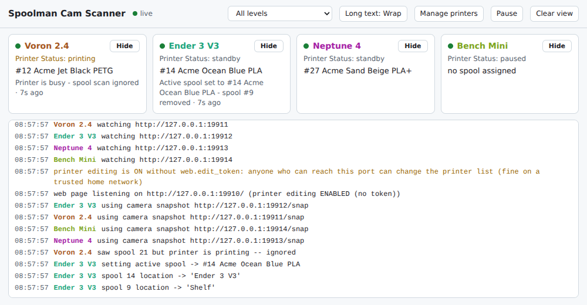
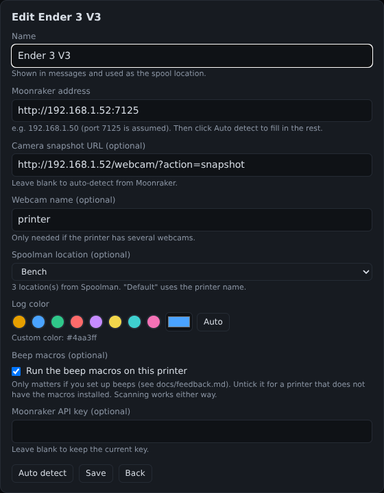

# Spoolman Cam Scanner

[](LICENSE)

**Wave a spool in front of a printer's webcam and it becomes that printer's active spool in Spoolman.**

<picture>
  <source media="(prefers-color-scheme: dark)" srcset="docs/images/overview-dark.png">
  
</picture>

<sub>Screenshots use demo data.</sub>

Klipper + Moonraker + Spoolman already track filament use per spool, but you have to pick the active spool by hand on every
printer. This small service watches each printer's **existing webcam** for the QR label that Spoolman prints, and does the
rest. No NFC readers, no new tags, nothing installed on the printers.

## What it does

- Sets the scanned spool as the **active spool** on that printer (the same Moonraker call the `SET_ACTIVE_SPOOL` macro makes).
- Updates the spool's **Location** in Spoolman to the printer's name.
- Takes the spool **off the printer it came from**, and puts the spool it replaces back on the shelf.
- A special **"clear spool" label** un-assigns the current spool.
- **Confirms every scan** in the Mainsail/Fluidd console, with an optional pop-up, optional beeps or LEDs on the printer, and an optional command on the server.
- An optional **live page**: a card per printer, a colour-coded log, and add/edit/remove printers from the browser. It embeds in dashboards such as Homepage, Dashy and Home Assistant.

```
 printer webcam ──snapshot──▶ ┌────────────────────┐ ──▶ Moonraker ──▶ Spoolman
 (mjpg-streamer / crowsnest)  │ spool_cam_scanner  │      set active spool, location
                              │  QR decode + logic │ ──▶ console message / pop-up / beep macro
 browser / dashboard ◀─────── │  live web page     │
                              └────────────────────┘
```

## When it works, and when it doesn't

**It never changes anything while a printer is printing.** A scan during a print is ignored, so filament usage from a running
job can't be charged to the wrong spool.

| Printer state | Scan |
|---|---|
| idle (`standby`), `complete`, `cancelled`, `error` | accepted |
| **`paused`**: Pause button, filament-runout pause, or a **colour change** (`M600` macro calling `PAUSE`) | **accepted** |
| `printing` (including the heat-up in your start G-code) | **ignored** |

So for a colour change: the print pauses, you swap the spool, show the new label to the camera, then resume. Full details, including
the sequence, caveats and what the scanner never does, are in [How it operates](docs/operation.md). The colour-change flow is
covered by automated tests against simulated printers but **has not yet been verified on real hardware**.

## Requirements

- Klipper printers running **Moonraker with the `[spoolman]` component enabled**, each with a webcam configured in Moonraker
- A running **Spoolman** server whose spool labels carry a QR code (Spoolman's default labels do)
- Python 3.9+ on the machine that runs the scanner, with `opencv-python-headless`, `numpy` and `requests`

## Quick start

### Option A: the installer (Debian, Ubuntu, Raspberry Pi OS, Proxmox containers)

```bash
curl -fsSL https://raw.githubusercontent.com/Zouljiin/spoolman-cam-scanner/main/install.sh | sudo bash
```

It asks for your first printer's address, installs to `/opt/spoolman-cam-scanner` (its own Python environment, a dedicated
service user), and offers to start it now and on every boot. If you'd rather read a script before running it (a good habit),
download it first: `curl -fsSLO <the same URL>`, look at `install.sh`, then `sudo bash install.sh`.
Later: `sudo bash /opt/spoolman-cam-scanner/install.sh update` (or `uninstall`). Details in [docs/installation.md](docs/installation.md).

### Option B: by hand (any system with Python)

```bash
git clone https://github.com/Zouljiin/spoolman-cam-scanner.git /opt/spoolman-cam-scanner
cd /opt/spoolman-cam-scanner
python3 -m venv venv
venv/bin/pip install -r requirements.txt
cp config.example.json config.json      # then edit: your printers' Moonraker addresses
venv/bin/python spool_cam_scanner.py -c config.json --dry-run
```

Hold a spool label up to a printer's camera (15-30 cm away, so the QR fills a good part of the picture). You should see a
`setting active spool -> #41 ...` line. `--dry-run` changes nothing; drop the flag to go live, then follow
[docs/installation.md](docs/installation.md) to run it as a service (the installer above does this for you).

## The live page

Turn it on with `"web": {"enabled": true}` in `config.json`. Each printer gets a card: a status dot for the **camera**, Klipper's
**Printer Status**, the active spool, and the last scan. Long lines can wrap or scroll, printers can be hidden from the log, and
each printer gets its own log colour. Settings are remembered in your browser.

With `"allow_edit": true` you can add, edit, auto-detect and remove printers from the page, including a location drop-down filled
from Spoolman and a colour picker:



See [docs/dashboards.md](docs/dashboards.md) and [docs/managing-printers.md](docs/managing-printers.md).

## Documentation

| | |
|---|---|
| [How it operates](docs/operation.md) | What a scan does, printing / paused / colour-change rules, what it never does, failure behaviour |
| [Installation](docs/installation.md) | Step-by-step setup, running as a service, updating |
| [Configuration](docs/configuration.md) | Every setting explained |
| [Labels](docs/labels.md) | Which QR formats work, and the "clear spool" label |
| [Feedback](docs/feedback.md) | Console messages, pop-ups, beeps/LEDs, custom commands |
| [Live web page](docs/dashboards.md) | The page and how to embed it in dashboards |
| [Managing printers](docs/managing-printers.md) | Add, edit and remove printers from the browser |
| [FAQ](docs/faq.md) | Common questions |
| [Troubleshooting](docs/troubleshooting.md) | Camera, network and QR problems, and a compatibility list |

## Safety and privacy

- Never touches a printer that is printing (details above).
- Only acts on a valid, known spool label; anything else in view is ignored.
- Camera pictures are decoded in memory and never stored. Nothing leaves your network.
- `--dry-run` shows what would happen without changing anything.
- The live page has **no login**; keep it on a trusted network. Printer editing is off unless you enable it. See [docs/managing-printers.md](docs/managing-printers.md#security).

## Status

Version 0.1.0. In daily use on several Klipper printers running Moonraker v0.11.0 with Mainsail, with the scanner in a small
Debian 13 container. Beeps rely on an `M300` macro, so they need a buzzer. See the compatibility list in
[docs/troubleshooting.md](docs/troubleshooting.md) and the [issues](https://github.com/Zouljiin/spoolman-cam-scanner/issues).

## Limitations

- One active spool per printer, as Moonraker tracks it. Multi-extruder and toolchanger printers aren't handled specially.
- QR labels only (no NFC or barcodes). The camera must provide a snapshot through Moonraker's webcam settings.
- The colour-change (paused) flow is untested on real hardware; see above.

## Prior art and thanks

Other projects select the active spool with **NFC tags**, for example
[klipper-nfc-daemon](https://github.com/goeland86/klipper-nfc-daemon) and nfc2klipper. We didn't find one that uses the printer's existing
webcam and Spoolman's own QR labels, which is what this project does. The closest camera-based thing we saw was a
proof-of-concept macro in [KlipperScreen issue #1097](https://github.com/KlipperScreen/KlipperScreen/issues/1097).

It builds on [Spoolman](https://github.com/Donkie/Spoolman), Klipper, [Moonraker](https://moonraker.readthedocs.io/en/latest/external_api/integrations/)
and its Spoolman integration ([Mainsail docs](https://docs.mainsail.xyz/features/spool-management/)), and on OpenCV for QR decoding.

## Disclaimer

Spoolman Cam Scanner is an independent community project. It is **not affiliated with, endorsed by or supported by** the Spoolman,
Klipper, Moonraker, Mainsail or Fluidd projects or their authors; those names are used only to describe compatibility.
It is provided **as is, without warranty** (see sections 15 and 16 of the GPL). You are responsible for what you run on your
network and your printers, so try it with `--dry-run` first.

## Contributing

Bug reports, printer/camera compatibility notes and pull requests are welcome. To run the tests: `pip install -r requirements-dev.txt && python -m pytest tests`. The tests use simulated printers, so no hardware is needed. By contributing you agree your work is licensed under the project's license.

## License

Copyright (C) 2026 Zouljiin. Licensed under the **GNU General Public License v3.0 or later** (GPL-3.0-or-later). See [LICENSE](LICENSE).
